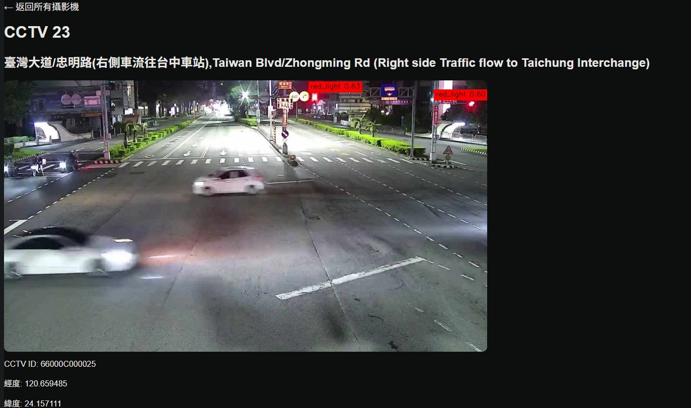
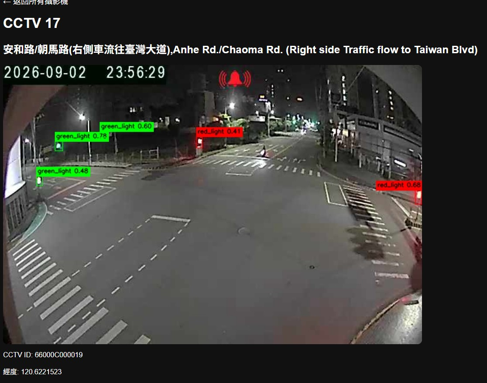

# 🚦 Taichung Traffic Light Detection Web App

> 使用台中市政府公開 CCTV 即時影像，搭配 OpenCV、FastAPI 與 Roboflow Hosted Inference API，進行交通號誌即時辨識。

---

## 📌 專案介紹

本專案以 **台中市政府公開交通 CCTV** 為資料來源，取得道路即時影像後，透過 **Roboflow Hosted Inference API** 執行交通號誌辨識，並將辨識結果即時顯示在瀏覽器中。

除了基本的 AI 偵測之外，也加入了 CCTV 串流斷線重連、背景推論、道路搜尋、Web 介面與 API Key 安全管理等功能，將原本單純的模型測試整合成可實際操作的 Computer Vision Web App。

---

## ✨ 主要功能

- 🗺️ 取得台中市政府公開 CCTV 清單
- 🔎 依道路 / 路口搜尋 CCTV
- 🎥 即時觀看 CCTV 串流
- 🤖 AI 交通號誌辨識
- 🔴 Red Light 偵測
- 🟡 Yellow Light 偵測
- 🟢 Green Light 偵測
- 📦 顯示 Bounding Box
- 📊 顯示 Confidence
- 🎨 不同燈號使用不同顏色標示
- ⚡ 背景執行 Roboflow 推論，減少影像卡頓
- 🔄 CCTV 串流中斷後自動重新連線
- 🛡️ Roboflow API Key 使用 `.env` 管理
- 🌐 FastAPI + Jinja2 Web Interface
- ▶️ Windows 一鍵啟動腳本

---

## 🖼️ Demo

### 即時交通號誌辨識畫面





---

## 🧠 系統架構

```text
Taichung Government CCTV API
            │
            ▼
      CCTV Camera List
            │
            ▼
      CCTV Live Stream
            │
            ▼
          OpenCV
            │
            ▼
 Roboflow Hosted Inference API
            │
            ▼
   Bounding Box Rendering
            │
            ▼
         FastAPI
            │
            ▼
        Web Browser
```

---

## 🛠️ Tech Stack

### Backend
- Python
- FastAPI
- Jinja2
- Requests
- BeautifulSoup
- ThreadPoolExecutor

### Computer Vision
- OpenCV
- Roboflow Hosted Inference API
- Object Detection

### Frontend
- HTML
- CSS
- JavaScript

### Version Control
- Git
- GitHub

---

## 📂 Project Structure

```text
taichung-traffic-light-detection/
│
├── app.py
├── get_cctv.py
├── start_traffic_light.cmd
├── README.md
├── .gitignore
│
├── templates/
│   ├── index.html
│   └── camera.html
│
├── static/
│   └── style.css
│
└── screenshots/
    └── traffic_light_detection.png
```

---

## ⚙️ 安裝方式

### 1. Clone 專案

```bash
git clone https://github.com/a12754213/taichung-traffic-light-detection.git
cd taichung-traffic-light-detection
```

### 2. 建立虛擬環境

Windows PowerShell：

```powershell
python -m venv .venv
.\.venv\Scripts\Activate.ps1
```

### 3. 安裝套件

```bash
pip install fastapi uvicorn opencv-python requests beautifulsoup4 python-dotenv inference-sdk jinja2
```

---

## 🔐 設定 Roboflow API Key

在專案根目錄建立：

```text
.env
```

內容：

```env
ROBOFLOW_API_KEY=YOUR_API_KEY
```

`.env` 不應提交到 GitHub。

建議 `.gitignore` 至少包含：

```gitignore
.env
.venv/
__pycache__/
*.pyc
```

---

## ▶️ 啟動網站

### 方法 1：Windows 一鍵啟動

直接執行：

```text
start_traffic_light.cmd
```

### 方法 2：手動啟動

```bash
uvicorn app:app --reload
```

啟動後開啟：

```text
http://127.0.0.1:8000
```

---

## 🔍 AI 推論流程

1. 從台中市政府 API 取得 CCTV 清單
2. 使用 CCTV 頁面網址解析真正的影像串流
3. OpenCV 讀取 CCTV 即時畫面
4. 每隔一段時間將影像送至 Roboflow Hosted API
5. 取得模型預測結果
6. 將 Bounding Box、Class 與 Confidence 畫回影像
7. FastAPI 以 MJPEG 串流形式送至瀏覽器
8. CCTV 中斷時自動重新建立連線

---

## ⚡ 背景推論

Roboflow API 為網路請求，如果直接在主影像迴圈中執行，可能造成 CCTV 畫面短暫卡頓。

本專案使用：

```python
ThreadPoolExecutor(max_workers=1)
```

將 AI 推論放到背景執行緒執行，使 CCTV 串流與 API 推論分離，提升即時觀看體驗。

---

## 🔄 CCTV 斷線處理

部分 CCTV 串流可能會定期中斷，因此程式在偵測到影像讀取失敗後，會：

```text
串流中斷
   ↓
釋放 VideoCapture
   ↓
等待短暫時間
   ↓
重新連線 CCTV
   ↓
繼續播放
```

避免網站因單次斷線直接停止服務。

---

## 🎯 專案學習重點

本專案主要實作與學習：

- Computer Vision
- Object Detection
- OpenCV 即時影像處理
- REST API 串接
- CCTV 串流處理
- Web App 開發
- FastAPI
- Jinja2
- HTML / CSS / JavaScript
- 背景執行緒
- API Key 安全管理
- Git / GitHub 版本控制

---

## 🚀 Future Improvements

- [ ] CCTV 地圖顯示
- [ ] 攝影機狀態監控
- [ ] 即時偵測統計
- [ ] 紅綠燈歷史紀錄
- [ ] 偵測結果資料庫
- [ ] 多 CCTV 同時監控
- [ ] 模型本機部署
- [ ] ONNX / TensorRT 加速
- [ ] Docker 部署
- [ ] 雲端部署

---

## 📚 Data Source

本專案使用 **臺中市政府公開交通即時道路影像資料**。

CCTV 影像與道路資訊來源屬於政府公開資料，本專案僅作為 AI / Computer Vision 學習與作品展示用途。

---

## 👨‍💻 Author

GitHub: [a12754213](https://github.com/a12754213)

Repository: [taichung-traffic-light-detection](https://github.com/a12754213/taichung-traffic-light-detection)

---

## 📄 License

目前本專案未指定開源 License。

如需公開供他人修改、散布或商業使用，可再加入適合的 License，例如 MIT License。
